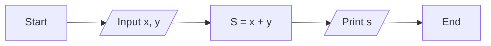
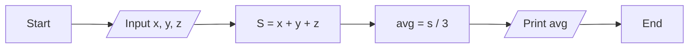

> Input processing output framework

#### Input ➡️ **Program** ➡️ Output
#### Input ➡️ ***Processing*** ➡️ Output

Example : 
1. Input x, y ➡️ **sum** ➡️ x + y
2. Input x, y ➡️ **Even** ➡️  Yes/No

> Flow Chart

Sum 2 numbers flow chart


Average flow chart

> Variables and Data Types

~ learn about variables

first we need to declare variables in c


Also in c language , we need to tell the types of that variable
Example : 

- int a;
  - integer 12

- float b;
  - float 2.667

- double a;
  - double 2.4315123456789

- char d;
  - char 'a';

Who to write varibales names :
- Rules :

✅a1  a2

❌1a  12a

✅a1b

❌Student mark

✅Student_mark

❌puncation marks not allow in variables name

❌keyword ; Example : if else for while return printf

> Input/output functions

```
//Description: This is a simple program to take input from the user and print it on the screen.

#include<stdio.h> //This is a header file
int main() //This is the main function
{
    //Here we write the code
    //write input statement

    int a; //This is a variable declaration
    printf("Enter a number: ");//This is a output statement
    scanf("%d", &a);//This is a input statement

    printf("The variable of a is: %d", a);//This is a output statement
    return 0;//This is a return statement
```
Question : What is formet ispesifire ?

~ learn about format specifiers in C

> C Processing - Operators

Why we use scanf ?

> C Program : Find the area of a circle

~ learn about scanf system in details

~ learn about .o file

