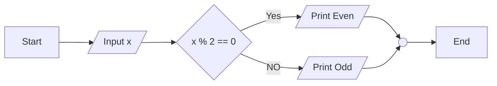
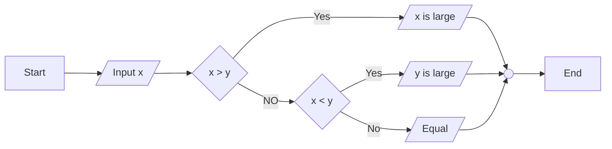

## Branching Statements

```mermaid
graph LR
A[Start] --> B[/Input x/] --> C{ x % 2 == 0 } --> |Yes|D[/Print Even/] --> id1(( ))
C --> |NO|E[/Print Odd/] --> id1
id1 --> F[End]
```

## if - else

```mermaid
graph LR
A[Start] --> B[/Input x/] --> C{ x > y } --> |Yes|D[/x is large/] --> id1(( ))
C --> |NO|E{ x < y } --> |Yes|F[/y is large/] --> id1
E  --> |No|G[/Equal/] --> id1
id1 --> H[End]
```
~ What is corner case ?
