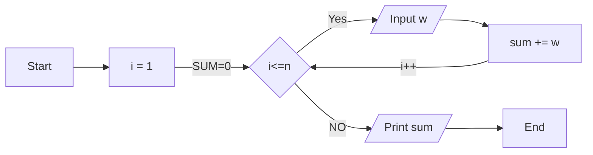

### Problem Solving using Looping Statements

Question 1: Calculate the total weight of passengers in a bus.
Draw the flowchart and write the program in C & Show manual tracing.

~ Flowchart ~


~ C Program ~

```c
#include<stdio.h>
int main()
{
    int n,w;
    int sum=0;
    printf("Enter the number of passengers: ");
    scanf("%d",&n);

    for(int i=1;i<=n;i++)
    {
        scanf("%d",&w);
        sum +=w;
    }

    printf("Total sum of weights = %d",sum);
    return 0;
}
```
~ Manual Tracing ~

input: 5

| i | w | sum |
|---|---|-----|
| 1 | 50 | 50 |
| 2 | 60 | 110 |
| 3 | 70 | 180 |
| 4 | 80 | 260 |
| 5 | 90 | 350 |

Question 2: You have n chocolates. If you give 4 packets to shopkeeper, he will give you 1 chocolate in return. How many chocolates you can get from shopkeeper? Also, how many chocolates you will have at the end?
Draw the flowchart and write the program in C & Show manual tracing.

~ Flowchart ~


