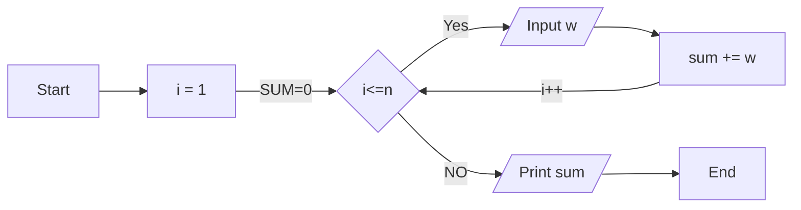

### Problem Solving using Looping Statements

```mermaid
graph LR
A[Start] --> id1[ i = 1]
id1 --> |SUM=0|B{i<=n} -->|Yes| C[/ Input w/]
B --> |NO|D[/Print sum/] --> E[End]
C --> id2[sum += w] -->|i++|B
```
