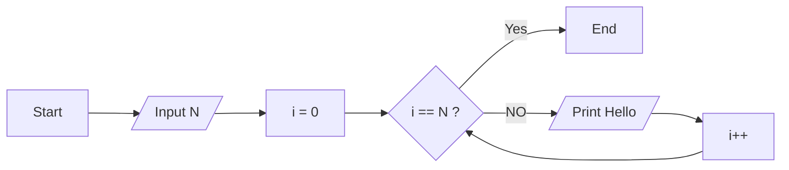
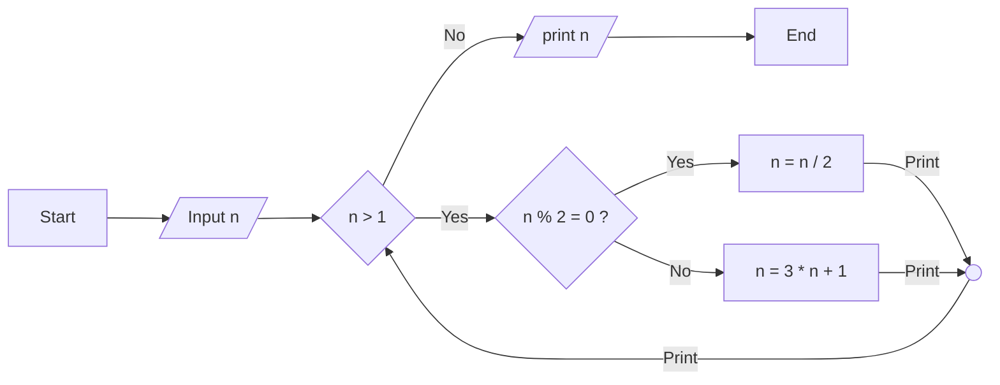

#### Looping Statements

Question 1: Draw a flowchart to print "Hello World" 10 times using for loop in marmaid.



Question 2: Draw a flowchart sum 1+2+3+.....+N using for loop in marmaid.


### While Loop

Syntax: 
    
    ```c
    while(condition){
        //statements
    }
    ```
i++ means i = i + 1
i-- means i = i - 1
increment and decrement operator


initialization
while(condition){
    //statements
    increment/decrement
}

### for loop

Syntax: 
    
    ```c
    for(initialization; condition; increment/decrement){
        //statements
    }
    ```

### Comparison between while loop and for loop



