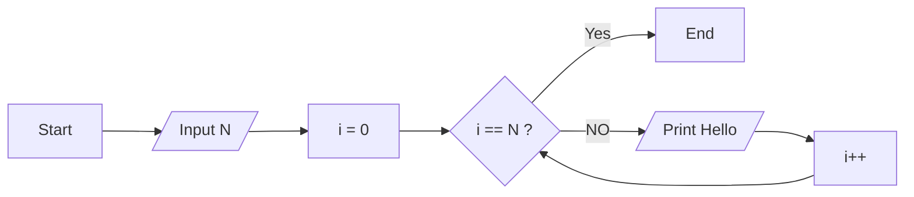

#### Looping Statements

Question 1: Draw a flowchart to print "Hello World" 10 times using for loop in marmaid.

```mermaid
graph LR
A[Start] --> B[/Input N/]
B --> id1[ i = 0 ] --> D{i == N ? }
D --> |Yes|E[End]
D --> |NO|F[/Print Hello/]
F --> id2[ i++] --> D

```
