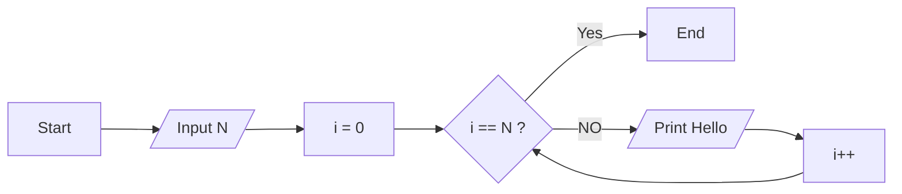
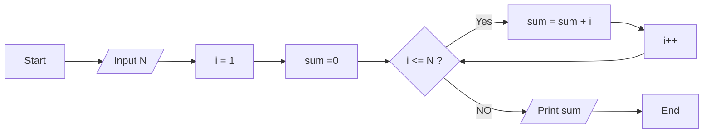

#### Looping Statements

Question 1: Draw a flowchart to print "Hello World" 10 times using for loop in marmaid.



```mermaid
graph LR
A[Start] --> B[/Input N/]
B --> id1[ i = 0 ] --> D{i == N ? }
D --> |Yes|E[End]
D --> |NO|F[/Print Hello/]
F --> id2[ i++] --> D

```
Question 2: Draw a flowchart sum 1+2+3+.....+N using for loop in marmaid.


```mermaid
graph LR
A[Start] --> B[/Input N/]
B --> id1[ i = 1 ] --> id2[ sum =0 ] --> C{i <= N ? }
C --> |Yes|id3[sum = sum + i] --> id4[i++] --> C
C --> |NO|D[/Print sum/] --> E[End]
```

```